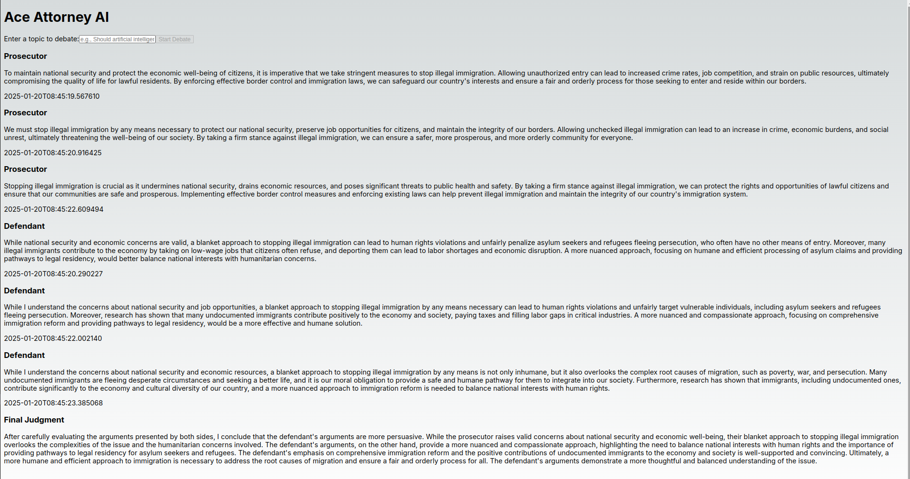

---

# Ace Attorney AI App MVP

## Overview

The **Ace Attorney AI App** simulates a legal debate between a prosecutor and a defendant. It leverages **FastAPI** for the backend and **Next.js** with **TypeScript** for the frontend, integrating **CopilotKit** and **Groq** for AI-powered functionalities. The app provides a structured workflow for alternating arguments, state management for smooth transitions between rounds, and enhanced error handling for debugging.

---

## Features

- **Structured Workflow**: Alternates arguments between the prosecutor and defendant in a logical sequence.
- **State Management**: Handles transitions between rounds effectively.
- **Error Handling & Logging**: Enhanced debugging capabilities with robust error handling and logging.
- **Multiple Rounds**: Supports multiple rounds of arguments and counter-arguments.
- **AI Integration**: Utilizes **CopilotKit** and **Groq** for intelligent debate simulation.

---

## Installation

### Prerequisites

- **Python 3.7+**
- **Node.js**
- **Virtual Environment** (recommended)

### Setup

1. **Clone the Repository**:
   ```bash
   git clone <repository-url>
   cd <repository-name>
   ```

2. **Set Up a Virtual Environment**:
   ```bash
   python -m venv venv
   source venv/bin/activate  # On Windows use `venv\Scripts\activate`
   ```

3. **Install Backend Dependencies**:
   ```bash
   pip install -r requirements.txt
   ```

4. **Install Frontend Dependencies**:
   ```bash
   cd ui
   npm install
   ```

5. **Set Environment Variables**:
   - In the `agent/` directory, create a `.env` file and add the following:
     ```
     GROQ_API_KEY=<your-groq-api-key>
     ```
   - In the `ui/` directory, create a `.env.local` file and add the following:
     ```
     GROQ_API_KEY=<your-groq-api-key>
     REMOTE_ACTION_URL=<your-backend-url>
     ```

---

## Running the Application

1. **Start the Backend Server**:
   ```bash
   python -m agent.agent
   ```

2. **Start the Frontend Server**:
   ```bash
   cd ui
   npm run dev
   ```

3. **Access the Application**:
   Open your browser and navigate to `http://localhost:3000`.

---

## Usage

1. **Initiate a Debate**:
   - Provide a topic to start the debate.

2. **Debate Flow**:
   - The app alternates between the prosecutor and defendant, allowing for arguments and counter-arguments.

3. **Final Judgment**:
   - The judge evaluates the debate and provides a final judgment.

---

## Screenshots

Below is a screenshot of the Ace Attorney AI App in action:



---

## Contributing

Contributions are welcome! If you'd like to contribute, please follow these steps:

1. Open an issue to discuss the changes you'd like to make.
2. Fork the repository and create a new branch for your feature or bugfix.
3. Submit a pull request with a detailed description of your changes.

---

## License

This project is licensed under the [MIT License](LICENSE).

---

## Acknowledgments

- **FastAPI** for the backend framework.
- **Next.js** and **TypeScript** for the frontend.
- **CopilotKit** and **Groq** for AI integration.

---

## Support

For any issues or questions, please open an issue on the repository or contact the maintainers.

---
